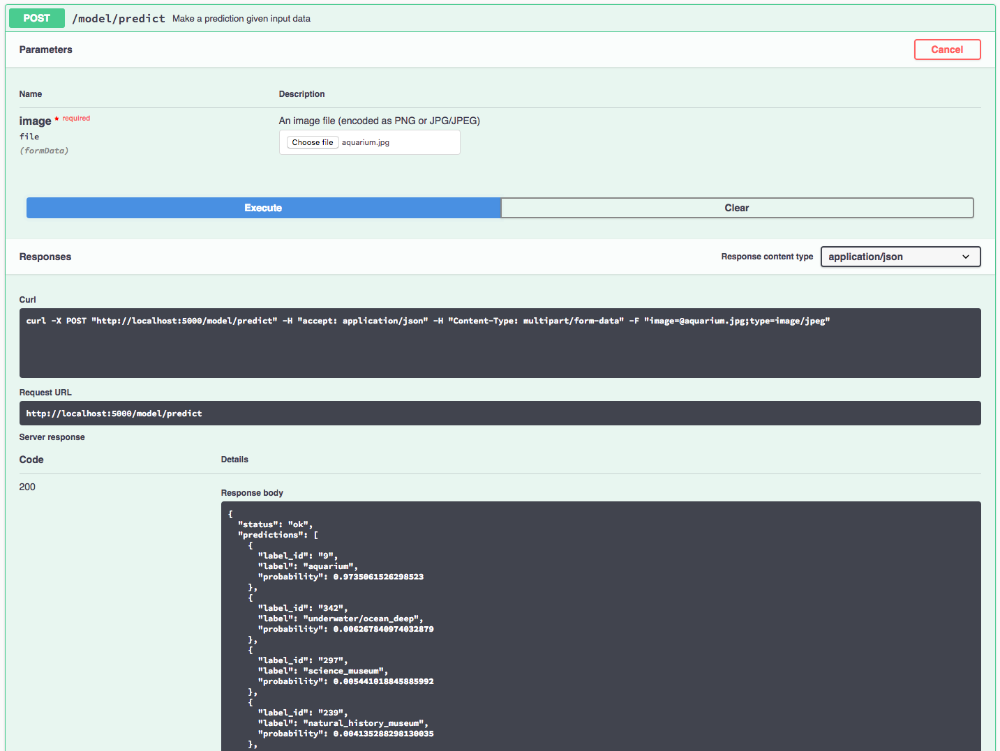

# IBM Code Model Asset Exchange: Scene-Classifier

This repository contains code to instantiate and deploy an image classification model. This model recognizes the 365 different classes of scene/location in the [Places365-Standard subset of the Places2 Dataset](http://places2.csail.mit.edu/). The model is based on the [Places365-CNN Model](https://github.com/CSAILVision/places365) and consists of a pre-trained deep convolutional net using the ResNet architecture, trained on the [ImageNet-2012](http://www.image-net.org/challenges/LSVRC/2012/) data set. The pre-trained model is then fine-tuned on the Places365-Standard dataset. The input to the model is a 224x224 image, and the output is a list of estimated class probilities.

The specific model variant used in this repository is the [PyTorch Places365 ResNet18 Model](https://github.com/CSAILVision/places365#pre-trained-cnn-models-on-places365-standard). The model files are hosted on [IBM Cloud Object Storage](http://max-assets.s3-api.us-geo.objectstorage.softlayer.net/pytorch/places365/whole_resnet18_places365_python36.pth). The code in this repository deploys the model as a web service in a Docker container. This repository was developed as part of the [IBM Code Model Asset Exchange](https://developer.ibm.com/code/exchanges/models/).

## Model Metadata
| Domain | Application | Industry  | Framework | Training Data | Input Data Format |
| ------------- | --------  | -------- | --------- | --------- | -------------- | 
| Vision | Image Classification | General | Pytorch | [Places365](http://places2.csail.mit.edu/download.html) | Image (RGB/HWC)| 

## References

* _B. Zhou, A. Lapedriza, A. Khosla, A. Oliva, and A. Torralba_, ["Places: A 10 million Image Database for Scene Recognition"](http://places2.csail.mit.edu/PAMI_places.pdf), IEEE Transactions on Pattern Analysis and Machine Intelligence, 2017.
* _B. Zhou, A. Lapedriza, J. Xiao, A. Torralba and A. Oliva_, ["Learning Deep Features for Scene Recognition
using Places Database"](http://places.csail.mit.edu/places_NIPS14.pdf), Advances in Neural Information Processing Systems 27, 2014.
* _K. He, X. Zhang, S. Ren and J. Sun_, ["Deep Residual Learning for Image Recognition"](https://arxiv.org/pdf/1512.03385), CoRR (abs/1512.03385), 2015.
* [Places2 Project Page](http://places2.csail.mit.edu/)
* [Places365-CNN GitHub Page](https://github.com/CSAILVision/places365)

## Licenses

| Component | License | Link  |
| ------------- | --------  | -------- |
| This repository | [Apache 2.0](https://www.apache.org/licenses/LICENSE-2.0) | [LICENSE](LICENSE) |
| Model Weights | [CC BY License](https://creativecommons.org/licenses/by/4.0/) | [Places365-CNN](https://github.com/CSAILVision/places365)|
| Model Code (3rd party) | [MIT](https://opensource.org/licenses/MIT) | [Places365-CNN](https://github.com/CSAILVision/places365)|
| Test assets | Various | [Asset README](assets/README.md) |

## Pre-requisites:

* `docker`: The [Docker](https://www.docker.com/) command-line interface. Follow the [installation instructions](https://docs.docker.com/install/) for your system.
* The minimum recommended resources for this model is 2GB Memory and 2 CPUs.

# Steps

1. [Deploy from Docker Hub](#deploy-from-docker-hub)
2. [Deploy on Kubernetes](#deploy-on-kubernetes)
3. [Run Locally](#run-locally)

## Deploy from Docker Hub

To run the docker image, which automatically starts the model serving API, run:

```
$ docker run -it -p 5000:5000 codait/max-scene-classifier
```

This will pull a pre-built image from Docker Hub (or use an existing image if already cached locally) and run it.
If you'd rather checkout and build the model locally you can follow the [run locally](#run-locally) steps below.

## Deploy on Kubernetes

You can also deploy the model on Kubernetes using the latest docker image on Docker Hub.

On your Kubernetes cluster, run the following commands:

```
$ kubectl apply -f https://raw.githubusercontent.com/IBM/MAX-Scene-Classifier/master/max-scene-classifier.yaml
```

The model will be available internally at port `5000`, but can also be accessed externally through the `NodePort`.

## Run Locally

1. [Build the Model](#1-build-the-model)
2. [Deploy the Model](#2-deploy-the-model)
3. [Use the Model](#3-use-the-model)
4. [Development](#4-development)
5. [Cleanup](#5-cleanup)

### 1. Build the Model

Clone this repository locally. In a terminal, run the following command:

```
$ git clone https://github.com/IBM/MAX-Scene-Classifier.git
```

Change directory into the repository base folder:

```
$ cd MAX-Scene-Classifier
```

To build the docker image locally, run: 

```
$ docker build -t max-scene-classifier .
```

All required model assets will be downloaded during the build process. _Note_ that currently this docker image is CPU only (we will add support for GPU images later).

### 2. Deploy the Model

To run the docker image, which automatically starts the model serving API, run:

```
$ docker run -it -p 5000:5000 max-scene-classifier
```

### 3. Use the Model

The API server automatically generates an interactive Swagger documentation page. Go to `http://localhost:5000` to load it. From there you can explore the API and also create test requests.

Use the `model/predict` endpoint to load a test image (you can use one of the test images from the `assets` folder) and get predicted labels for the image from the API.



You can also test it on the command line, for example:

```
$ curl -F "image=@assets/acquarium.jpg" -XPOST http://localhost:5000/model/predict
```

You should see a JSON response like that below:

```json
{
  "status": "ok",
  "predictions": [
    {
      "label_id": "9",
      "label": "aquarium",
      "probability": 0.97350615262985
    },
    {
      "label_id": "342",
      "label": "underwater\/ocean_deep",
      "probability": 0.0062678409740329
    },
    {
      "label_id": "297",
      "label": "science_museum",
      "probability": 0.005441018845886
    },
    {
      "label_id": "239",
      "label": "natural_history_museum",
      "probability": 0.00413528829813
    },
    {
      "label_id": "167",
      "label": "grotto",
      "probability": 0.0024146677460521
    }
  ]
}
```

### 4. Development

To run the Flask API app in debug mode, edit `config.py` to set `DEBUG = True` under the application settings. You will then need to rebuild the docker image (see [step 1](#1-build-the-model)).

### 5. Cleanup

To stop the Docker container, type `CTRL` + `C` in your terminal.
